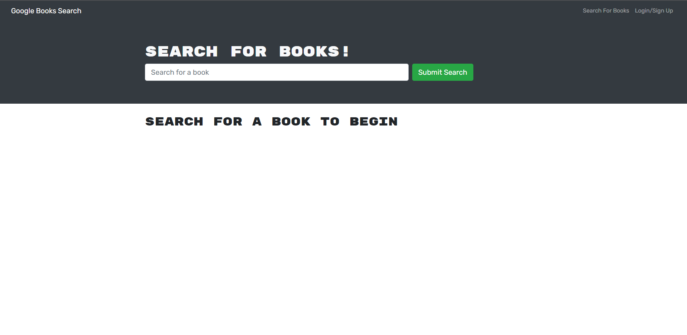

# Book Search

  

  ## Table of Contents
  - [Description](#description)
  - [Installation](#installation)
  - [Usage](#usage)
  - [License](#license)
  - [Contributions](#contributions)
  - [Tests](#tests)
  - [Questions](#questions)

  ## Description
  
  This project uses MongoDB and Express to construct a database that interacts with ReactJs to enable an easy to use book search based off of Amazon listings.

  

  ## Installation
  Run npm i before launching, node index to start

  ## Usage
  N/A

 
  ## License
  This application is covered under the [MIT]((https://opensource.org/licenses/MIT)) license.
  

  ## Contributions
  N/A for this project

  ## Tests

  No tests at this time

  ## Image of Site
  

  ## Deployed Site
  https://book-search-create.herokuapp.com/

  ## Questions
 

  Email: meredith.a.mccollum@gmail.com 
  Github: [https://github.com/MAMcC0](https://github.com/MAMcC0)